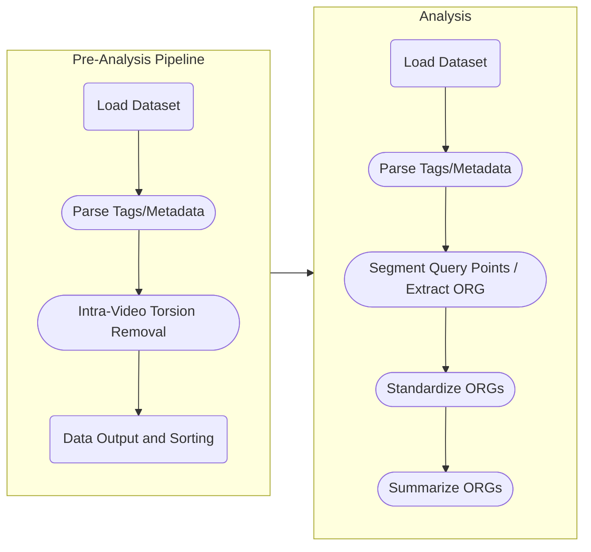

# 𝑓(Cell) - Function of the Cell

|         |                                                                                                      |
|---------|------------------------------------------------------------------------------------------------------|
| Package |  |

## Introduction:
This repository is where the OCVL does most of its optoretinography (abbreviated to ORG) software development. This software will always be open source, and available to any researcher using it for non-profit work. For the moment, the software is designed around intensity-based optoretinography, or iORG processing. That means that it is capable of processing/analyzing data from any en-face device that produces videos (not volumes), such as scanning laser ophthalmoscopes or line-scan ophthalmoscopes, and their adaptive optics variants (e.g. AO-SLO/AO-LSO/AO-FiO). However, we will be expanding this software to analyze OCT data  in the near future, pending grant support to do so.

## Using the software:
Working with optoretinograms often requires supra-normal processing of AOSLO/AOLSO/AOOCT datasets, so we have broken optoretinogram generation into a "pipeline" stage and an "analysis" stage. 

For quick start information, [please see our wiki](https://github.com/OCVL/F-Cell/wiki/Quick-Start).

How these stages work are governed by json-based configuration files that allow you to run the code on your data's particular filename, video, and metadata format. It also allows you to specify the parameters used during the processing and analysis steps, for your specific scientific problem. We have developed an easy-to-use configuration file generator to make this process as simple as possible, and it is included in all of our [software releases](https://github.com/OCVL/F-Cell/releases).

### How it works:
𝑓(Cell) operates in the following stages, which are detailed in our [wiki](https://github.com/OCVL/F-Cell/wiki).

The basic steps in the pre-analysis pipeline and analysis stages are as follows:

```mermaid
flowchart LR

    subgraph preanalysis["Pre-Analysis Pipeline"]
        direction TB
    AA(Load Dataset) --> BB([Parse Tags/Metadata])
    BB([Parse Tags/Metadata]) --> HH([Intra-Video Torsion Removal])
    HH([Intra-Video Torsion Removal]) --> II(Data Output and Sorting)
    end

    preanalysis --> analysis

    subgraph analysis["Analysis"]
        direction TB
    A(Load Dataset) --> B([Parse Tags/Metadata])
    B([Parse Tags/Metadata])  --> D([Segment Query Points / Extract ORGs])
    D([Segment Query Points / Extract ORG])  --> E([Standardize ORGs])
    E([Standardize ORGs])  --> F([Summarize ORGs])
    end
    
    click BB "https://github.com/OCVL/F-Cell/wiki/Advanced:-Tag-Parsing" "Tag Parsing"
    click CC "https://github.com/OCVL/F-Cell/wiki/Advanced:-Pre%E2%80%90Analysis-Pipeline#general-parameters" "Custom Steps"
    click DD "https://github.com/OCVL/F-Cell/wiki/Advanced:-Pre%E2%80%90Analysis-Pipeline#trimming" "Trim Video"
    click EE "https://github.com/OCVL/F-Cell/wiki/Advanced:-Pre%E2%80%90Analysis-Pipeline#flat-fielding" "Flat Field"
    click FF "https://github.com/OCVL/F-Cell/wiki/Advanced:-Pre%E2%80%90Analysis-Pipeline#blurring" "Blurring"
    click GG "https://github.com/OCVL/F-Cell/wiki/Advanced:-Pre%E2%80%90Analysis-Pipeline#roi-masking" "Crop Video"
    click HH "https://github.com/OCVL/F-Cell/wiki/Advanced:-Pre%E2%80%90Analysis-Pipeline#torsion-correction" "Intra-Video Torsion Removal"

    click B "https://github.com/OCVL/F-Cell/wiki/Advanced:-Tag-Parsing" "Tag Parsing"
    click C "https://github.com/OCVL/F-Cell/wiki/Advanced:-Analysis-Parameters#data-normalization" "Normalize Data"
    click D "https://github.com/OCVL/F-Cell/wiki/Advanced:-Analysis-Parameters#query-point-segmentation" "Query Point Segmentation"
    click E "https://github.com/OCVL/F-Cell/wiki/Advanced:-Analysis-Parameters#signal-standardization" "Standardization"
    click F "https://github.com/OCVL/F-Cell/wiki/Advanced:-Analysis-Parameters#org-summary" "Summarization"
    click G "https://github.com/OCVL/F-Cell/wiki/Advanced:-Analysis-Metrics" "Metrics"
    click H "https://github.com/OCVL/F-Cell/wiki/Advanced:-Analysis-Display-Parameters" "Display Results"
```

### Configuration files:
The configuration file uses a json file format. At the moment, its creation is manual, though we will be developing a GUI tool for easy creation/updating of parameters in the coming months. **Note: Examples can be found in the config_files directory.**

The [wiki](https://github.com/OCVL/F-Cell/wiki) containing instructions on how to use the pipeline as well as how to write a configuration file is currently under construction, but keep an eye for more instructions in March.

### Attribution:
If you use this software for your work, please cite us! The current citation is:

Cooper RF, Gaffney M, Brennan BD, Rios N. “ƒ(Cell): Software for reproducible analysis of optoretinograms.” 2026 Translational Vision Science & Technolology. 15(3), 23
