# 𝑓(Cell) - Function of the Cell

## Introduction:
This repository is where the OCVL does most of its optoretinography (abbreviated to ORG) software development. This software will always be open source, and available to any researcher using it for non-profit work. For the moment, the software is designed around intensity-based optoretinography, or iORG processing. That means that it is capable of processing/analyzing data from any en-face device that produces videos (not volumes), such as scanning laser ophthalmoscopes or line-scan ophthalmoscopes, and their adaptive optics variants (e.g. AO-SLO/AO-LSO/AO-FiO).

### How it works:
𝑓(Cell) operates in the following stages, which are detailed in our [wiki](https://github.com/OCVL/F-Cell/wiki).

**NOTE:** Each of the steps with an asterisk preceeding it is optional.

```mermaid
flowchart LR

    subgraph preanalysis["Pre-Analysis Pipeline"]
        direction TB
    AA(Load Dataset) --> BB([Parse Tags/Metadata])
    BB([Parse Tags/Metadata]) --> CC([*Perform Custom Steps]) 
    CC([*Perform Custom Steps]) --> DD([*Trim Video]) 
    DD([*Trim Video]) --> EE([*Flat Field]) 
    EE([*Flat Field]) --> FF([*Gaussian Blur]) 
    FF([*Gaussian Blur]) --> GG([*Crop Video]) 
    GG([*Crop Video]) --> HH([*Intra-Video Torsion Removal])
    HH([*Intra-Video Torsion Removal]) --> II(Data Output and Sorting)
    end

    preanalysis --> analysis

    subgraph analysis["Analysis"]
        direction TB
    A(Load Dataset) --> B([Parse Tags/Metadata])
    B([Parse Tags/Metadata])  --> C([Normalize Dataset])
    C([Normalize Dataset])  --> D([Segment Query Points / Extract ORGs])
    D([Segment Query Points / Extract ORG])  --> E([Standardize ORGs])
    E([Standardize ORGs])  --> F([Summarize ORGs])
    F([Summarize ORGs])  --> G([Extract Metrics])
    G([Extract Metrics])  --> H(Display/Output Results)
    end
    
    click BB "https://github.com/OCVL/F-Cell/wiki/Advanced:-Tag-Parsing" "Tag Parsing"
    click CC "https://github.com/OCVL/F-Cell/wiki/Advanced:-Pre%E2%80%90Analysis-Pipeline#general-parameters" "Custom Steps"
    click DD "https://github.com/OCVL/F-Cell/wiki/Advanced:-Pre%E2%80%90Analysis-Pipeline#trimming" "Trim Video"
    click EE "https://github.com/OCVL/F-Cell/wiki/Advanced:-Pre%E2%80%90Analysis-Pipeline#flat-fielding" "Flat Field"
    click FF "https://github.com/OCVL/F-Cell/wiki/Advanced:-Pre%E2%80%90Analysis-Pipeline#blurring" "Blurring"
    click GG "https://github.com/OCVL/F-Cell/wiki/Advanced:-Pre%E2%80%90Analysis-Pipeline#roi-masking" "Crop Video"
    click HH "https://github.com/OCVL/F-Cell/wiki/Advanced:-Pre%E2%80%90Analysis-Pipeline#torsion-correction" "Intra-Video Torsion Removal"

    click B "https://github.com/OCVL/F-Cell/wiki/Advanced:-Tag-Parsing" "Tag Parsing"
    click C "https://github.com/OCVL/F-Cell/wiki/Advanced:-Analysis-Parameters#data-normalization" "Normalize Data"
    click D "https://github.com/OCVL/F-Cell/wiki/Advanced:-Analysis-Parameters#query-point-segmentation" "Query Point Segmentation"
    click E "https://github.com/OCVL/F-Cell/wiki/Advanced:-Analysis-Parameters#signal-standardization" "Standardization"
    click F "https://github.com/OCVL/F-Cell/wiki/Advanced:-Analysis-Parameters#org-summary" "Summarization"
    click G "https://github.com/OCVL/F-Cell/wiki/Advanced:-Analysis-Metrics" "Metrics"
    click H "https://github.com/OCVL/F-Cell/wiki/Advanced:-Analysis-Display-Parameters" "Display Results"
    style preanalysis fill:#203040, stroke:#FFFFFF, stroke-width:2px
    style analysis fill:#203040, stroke:#FFFFFF, stroke-width:2px
classDef default fill:#000F1E, stroke:#FFFFFF, stroke-width:2px
```

## Using the software:
Working with optoretinograms often requires supra-normal processing of AOSLO/AOLSO/AOOCT datasets, so we have broken optoretinogram generation into a "pipeline" stage and an "analysis" stage. 

For quick start information, [please see our wiki](https://github.com/OCVL/F-Cell/wiki/Quick-Start).

How these stages work are governed by json-based configuration files that allow you to run the code on your data's particular filename, video, and metadata format. It also allows you to specify the parameters used during the processing and analysis steps, for your specific scientific problem.

### Configuration files:
The configuration file uses a json file format. At the moment, its creation is manual, though we will be developing a GUI tool for easy creation/updating of parameters in the coming months. **Note: Examples can be found in the config_files directory.**

The [wiki](https://github.com/OCVL/F-Cell/wiki) containing instructions on how to use the pipeline as well as how to write a configuration file is currently under construction, but keep an eye for more instructions in March.

### Attribution:
In the future, if you use this software you will be able to cite a paper referring to this repository. In the meantime, please cite Gaffney et. al., "Intensity-based optoretinography reveals sub-clinical deficits in cone function in retinitis pigmentosa", 2024 - the algorithms and software used in that paper encapsulate those seen here, and this software was used for that paper.
